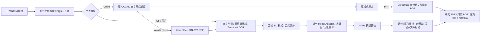

# 译页 · TranslatorHelper 2.0

AI 文档翻译与中英双栏阅读工作台。基于已有 React / Vite + FastAPI 项目重构，支持 PDF、PNG、JPG/JPEG、DOCX、PPTX、XLSX。默认使用千炼 OpenAI 兼容接口，提供 Qwen、Kimi、DeepSeek、GLM 八个预设模型和自定义模型 ID。

## 本地运行

需要 Node.js 20+、Python 3.13、Tesseract（英文 OCR）及 LibreOffice（Office 转 PDF）。

```bash
python3 -m venv .venv
.venv/bin/pip install -r requirements-dev.txt
cp .env.example .env
# 在 .env 填入 DASHSCOPE_API_KEY；不要提交 .env
cd frontend
npm ci
npm run build
cd ..
.venv/bin/python -m uvicorn backend.app.main:app --host 127.0.0.1 --port 8010
```

打开 http://127.0.0.1:8010 。开发时另外运行 `cd frontend && npm run dev`，打开 http://127.0.0.1:5173 ，API 代理到 8010。

macOS 系统依赖：`brew install tesseract` 和 `brew install --cask libreoffice`。Docker 镜像已经包含系统依赖和中文字体。也可用 `LIBREOFFICE_BIN` 指定转换程序路径。

## 翻译与重建流程



- **数字 PDF**：以原 PDF 为底稿，提取文字坐标、字号、颜色和样式，识别表格单元格。只删除成功通过排版预检的文字字形，保留底层图片和矢量线条；不扩张擦除框，不截断译文，不强制写出页面边界。
- **公式和复杂文字**：数学字体、部分符号、上标、代码、旋转文字区域保留原样。含英文的受保护区域仍提供文本译文。LaTeX、引用和 URL 使用占位符保护，模型破坏标记时中止该任务。
- **OCR**：使用 Tesseract 的实际像素坐标识别英文，文本模型仅负责翻译。扫描件和平色背景图片可进行原位覆盖；低置信度、复杂背景和重叠区域保留原图并提示复核。混合 PDF 对大幅图片区域补充 OCR。
- **排版预检**：在临时页面试排完整译文，必要时适度缩小字号或延伸文字区域。原区域仍放不下时保留原文，完整译文保存在文本精读和质量报告中。
- **Word / PPT / Excel**：直接改写 ZIP 内 XML 的文字节点，保留段落和文字样式节点、图片、公式 XML、表格、合并单元格及关系文件。PPT 图表缓存标签和 SmartArt 数据文字也会翻译。Excel 不修改数字和公式；与公式字符串常量相同的文字也保留，以减少破坏匹配条件。
- **Office 页码对照**：PPT 的译文 PDF 直接由已翻译的 PPTX 转换，不再重复调用模型；原文与译文按幻灯片配对。Word/Excel 仍以原文件转换的 PDF 为基准重建对照页。缺少 LibreOffice 时仍输出原格式译文，界面明确说明没有 PDF 预览。

## 模型与配置

模型预设来自 `backend/app/config.py`，前端通过 `/api/config` 加载；用户可输入任意兼容模型 ID，也可通过 `MODEL_CATALOG_JSON` 替换整个目录。默认 `qwen3.7-flash`，可以用 `DEFAULT_MODEL` 更改。预设名称来源于项目需求，实际调用权限由服务商决定。

`CompatibleAdapter` 对所有供应商使用相同协议，模型不会被静默替换。它进行有界批处理、精确区域 ID 校验、公式占位符校验、任务内缓存、有限重试和错误脱敏。术语表随每批请求发送。

密钥只从服务端环境变量读取；网页、任务数据库、导出文件和日志均不保存密钥。`DASHSCOPE_BASE_URL` 只能在服务端配置，不接受浏览器传入任意地址。默认 `MODEL_TRUST_ENV=false`，使用标准 HTTPS 直连并校验证书；需要组织代理时设为 `true`。

## 任务与文件

- 文件最大 50 MB，默认最多 200 页，图片最多 4000 万像素；Office 解压总量有限制并拒绝宏及非超链接类型外部关系。
- 上传文件名仅作展示；服务器生成文件 ID，客户端不能指定本地路径。
- 浏览器使用 HttpOnly / SameSite 会话 Cookie；任务、原文图片、译文和下载均校验所属会话，不对外开放目录。
- 公网部署设置 `APP_ACCESS_TOKEN`，在“模型设置”输入平台口令；口令与 API 密钥相互独立。
- SQLite 持久化任务和状态，单进程单工作队列避免多个 LibreOffice 实例争抢内存；每会话最多 3 个活动任务，全局最多 12 个。
- 取消在当前模型请求或转换步骤结束后生效，不保证终止已发送给服务商的请求。服务重启后未完成任务标记失败，可重新上传翻译；已完成任务保留。
- 当前版本适合个人或小团队单实例部署。会话 Cookie 有效期 30 天，清除浏览器 Cookie 后无法访问旧会话记录。尚无账户体系、自动数据清理、分布式队列或跨设备历史同步；管理员需按自己的保留政策清理私有数据目录。

## 质量边界

这里的“无痕”是优先保留版面并提供可检查的降级结果，**不承诺所有复杂文档像素级一致或全文自动翻译成功**。

数学和版面识别使用启发式规则，复杂行内公式可能需要复核。扫描背景修复针对平色区域，不提供任意照片背景修复。OCR 仅配置英文。页内图片里的文字不一定全部被识别。Office 的富文本按样式节点翻译，跨节点语序可能需要调整；SmartArt 与图表中的特殊对象、嵌入对象和艺术字仍可能需要复核。Excel 的动态公式引用与自定义函数仍应人工验算。

导出的中文 PDF 保持页面几何和页数，字号、换行可能变化。质量报告记录每个区域的原文、译文、坐标、处理状态和保留原因，不给出未经测量的质量百分比。

## 测试

```bash
.venv/bin/python -m pytest backend/tests -q
cd frontend && npm run build
```

测试验证：结构化模型响应、保护标记、溢出保留、PDF 图片与背景像素不变、Word 公式与样式、PPT 图片与位置、Excel 公式和合并、访问口令、会话隔离、路径安全及取消竞态。可运行 `.venv/bin/python backend/tests/make_fixtures.py` 生成六种格式的合成验收文件（保存在不提交的 `artifacts/fixtures/`）。测试不使用真实模型，真实服务联调需另行执行。

## 部署

见 [DEPLOY_RENDER.md](DEPLOY_RENDER.md)。整个应用用一个 Docker Web Service 部署，前端由 FastAPI 同域托管，避免跨域 Cookie 和双服务配置问题。

实现参考：[PyMuPDF 页面排版与 redaction 文档](https://pymupdf.readthedocs.io/en/latest/page.html)、[Render Blueprint 配置](https://render.com/docs/blueprint-spec)。使用 PyMuPDF 时请按项目的实际发布方式核对其 AGPL / 商业许可证要求。
